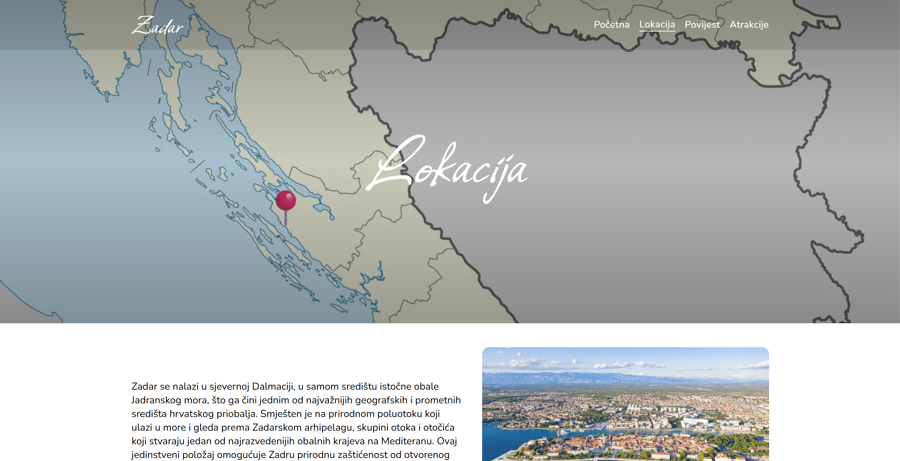
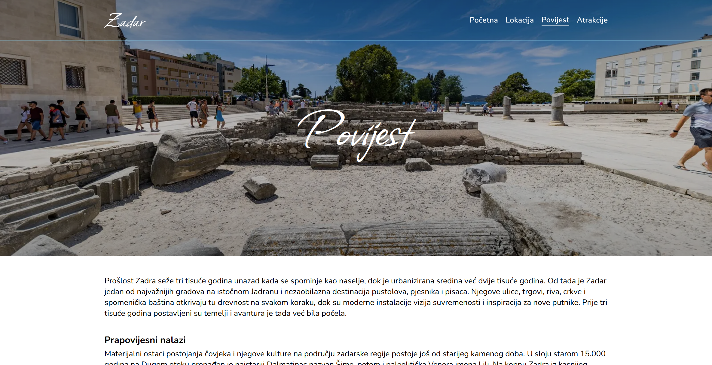
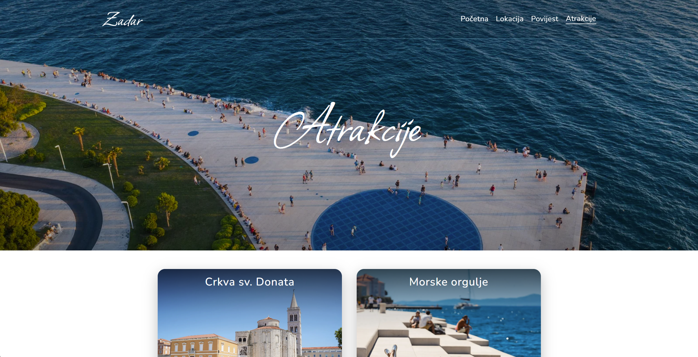

# Zadar City Website


[](https://zadar-city-guide.netlify.app/)


A responsive multi-page website about the city of Zadar built using **HTML, CSS and JavaScript**.

This website was created during my first year studying Information Technology online, as part of the Introduction to HTML and CSS course.
It presents information about the city including its **location, history and main attractions**.

The goal of the project was to practice building a structured website, working with layouts, navigation and responsive design.

---

# Screenshots

### Home Page


### Location Page



### History Page



### Attractions Page



---

# Features

- Multi-page website structure
- Responsive navigation menu
- Desktop and mobile navigation
- Hero sections with background images
- Image galleries
- Mobile hamburger menu
- Clean and consistent layout across pages
- Optimized **WebP images** for improved performance

---

# Pages

The website contains four main pages:

**Home**
General introduction to the city of Zadar.

**Location**
Information about the geographical position and region.

**History**
Overview of the city's long historical development.

**Attractions**
Highlights of important landmarks and places to visit.

---

# Project Structure

```
zadar-city-guide/
│
├── atrakcije/
├── img/
├── screenshots/
│
├── index.html
├── lokacija.html
├── povijest.html
├── atrakcije.html
│
├── style.css
├── main.js
│
└── README.md
```
